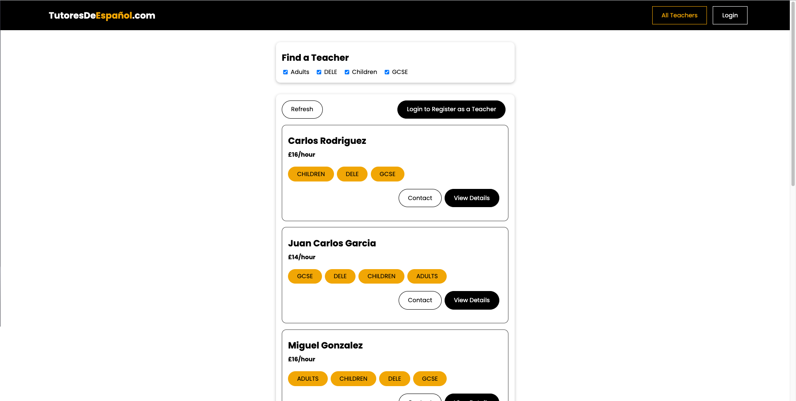
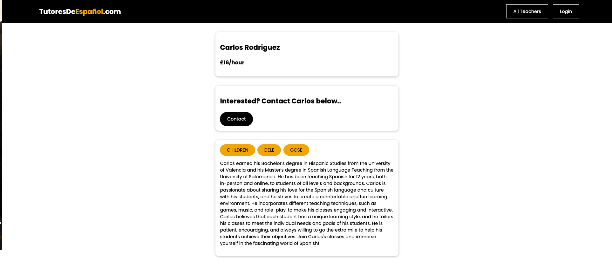
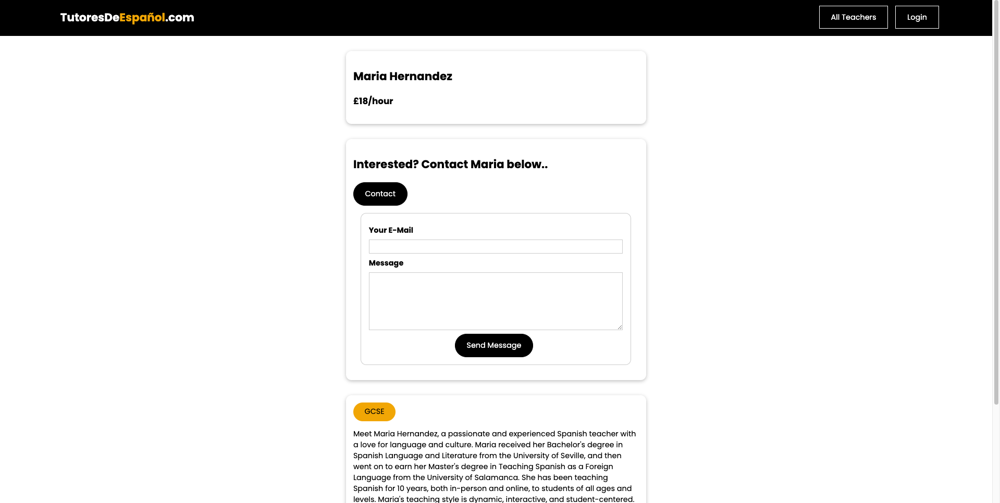
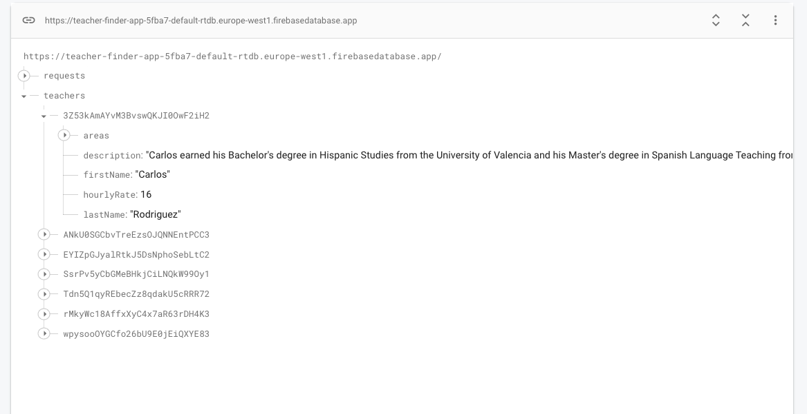

# TutoresDeEspanol.com Teacher Finder App

This repository contains the Teacher Finder app called TutoresDeEspanol.com, which is a web application created using Vue 3, Vue Router, User Authentication & Vuex, and Firebase for the backend.

## Overview

TutoresDeEspanol.com is a web application designed to help users find Spanish teachers. The app consists of three main pages: Teachers, Requests, and Authentication.

On the Teachers page, users can browse through a list of available Spanish teachers and filter them based on various criteria. The Requests page handles user requests, allowing them to register as a teacher or contact a teacher directly. The Authentication page allows users to sign up and log in to the application. Only logged-in teachers can view the messages sent to them by other users.

## Technologies Used

The TutoresDeEspanol.com app was created using the following technologies:

- Vue 3
- Vue Router
- User Authentication & Vuex
- Firebase

## Pages

The application consists of three types of pages:

- **Teachers**: This page displays the available teachers and allows users to filter them based on various criteria. The page also includes components for rendering teacher items and filters.

- **Requests**: This page handles user requests, allowing them to register as a teacher or contact a teacher directly.

- **Authentication**: This page allows users to sign up and log in to the application. Only logged-in teachers can view the messages sent to them by other users.

## Vuex Store

The Vuex store consists of three modules:

- **Teachers Module:** This module stores the teacher details.

- **Request Module:** This module handles user requests.

- **Authentication Module:** This module handles user authentication.

## Installation

To install the TutoresDeEspanol.com app, follow these steps:

1. Clone this repository to your local machine.
2. Install the required dependencies by running `npm install`.
3. Create a Firebase account and set up a new Firebase project.
4. Add a `.env` file to the project root with the following environment variables:
   - `VUE_APP_FIREBASE_API_KEY`: Your Firebase API key.
   - `VUE_APP_FIREBASE_AUTH_DOMAIN`: Your Firebase auth domain.
   - `VUE_APP_FIREBASE_PROJECT_ID`: Your Firebase project ID.
   - `VUE_APP_FIREBASE_STORAGE_BUCKET`: Your Firebase storage bucket.
   - `VUE_APP_FIREBASE_MESSAGING_SENDER_ID`: Your Firebase messaging sender ID.
   - `VUE_APP_FIREBASE_APP_ID`: Your Firebase app ID.
5. Start the development server by running `npm run serve`.

## Contributing

Contributions to the TutoresDeEspanol.com app are welcome! To contribute, follow these steps:

1. Fork this repository to your own GitHub account.
2. Create a new branch from the `main` branch with a descriptive name for your changes.
3. Make your changes and commit them with clear commit messages.
4. Push your changes to your fork.
5. Submit a pull request to the `main` branch of this repository.

